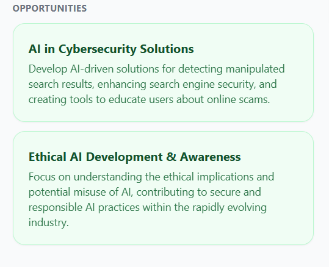
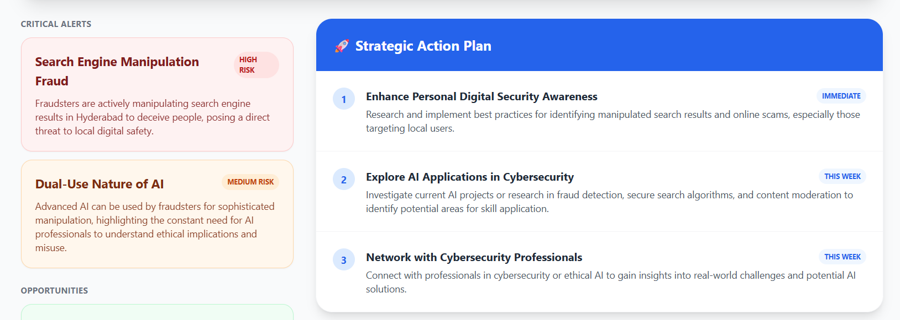

# 🌐 NewsOS

**NewsOS** is a forward-thinking personal intelligence engine designed to move beyond simple news aggregation. While currently functioning as a high-performance RSS aggregation hub, its ultimate vision is to act as an automated intelligence operating system. It aims to ingest global news feeds, assess real-time risks, and generate personalized, actionable plans based on current events.

## 🚀 Vision & Future Scope

The goal of NewsOS is to process unstructured news data and turn it into strategic intelligence. Future iterations will integrate Large Language Models (LLMs) to provide:
* **Contextual Risk Assessment:** Automatically scanning financial, political, and regional news to identify potential threats to personal or business operations.
* **Action Plan Generation:** Synthesizing breaking news into step-by-step mitigation or capitalization strategies.
* **Bias & Sentiment Analysis:** Stripping away editorial bias to present the raw facts and the underlying sentiment of global markets.

## ✨ Current Features (v1.0 - Foundation)

* **⚡ High-Speed RSS Aggregation:** A FastAPI-driven backend that concurrently fetches and normalizes feeds from top-tier sources (The Hindu, BBC, Al Jazeera, Moneycontrol, etc.).
* **🗂️ Smart Categorization:** Pre-configured categories mapping specific regional, national, and international feeds into digestible streams (Education, Finance, Politics, Cinema, Sports).
* 

* **🧠 Intelligent Caching:** Implements `cachetools` with a Time-To-Live (TTL) strategy to prevent rate-limiting from source servers while serving fresh news instantly.

# the alerting suggestion and route of action 

* **🎨 Responsive React UI:** A polished, Vite-powered frontend utilizing Tailwind CSS for a modern, scannable, and interactive card-based layout.

* **📈 Built-in Pagination & Skeleton Loading:** Ensures smooth user experience even when fetching massive amounts of data or dealing with slow network constraints.

## 🛠️ Tech Stack

### Backend
* **Python 3.x**
* **FastAPI:** High-performance async web framework.
* **Feedparser:** For parsing diverse RSS and Atom feeds.
* **Cachetools:** For efficient in-memory TTL caching.
* **Uvicorn:** ASGI server.

### Frontend
* **React (Vite):** Lightning-fast component rendering and dev server.
* **Tailwind CSS:** For utility-first, highly customizable styling.
* **Axios:** Promise-based HTTP client for backend communication.
* **Day.js:** Lightweight date formatting and relative time (e.g., "2 hours ago").

---

## 🚦 Getting Started

Follow these steps to get the foundational NewsOS Hub up and running on your local machine.

### Prerequisites
* [Node.js](https://nodejs.org/) (v16 or higher)
* [Python](https://www.python.org/downloads/) (v3.8 or higher)

### 1. Backend Setup (FastAPI)

Navigate to the directory containing `main.py` and set up your Python environment:

\`\`\`bash
# Create a virtual environment
python -m venv venv

# Activate the virtual environment
# On Windows:
venv\Scripts\activate
# On macOS/Linux:
source venv/bin/activate

# Install required dependencies
pip install fastapi uvicorn feedparser requests cachetools

# Run the backend server
uvicorn main:app --reload --port 8000
\`\`\`
*The backend will be available at `http://127.0.0.1:8000`. You can view the auto-generated API docs at `http://127.0.0.1:8000/docs`.*

### 2. Frontend Setup (React/Vite)

Navigate to your frontend directory (where `App.jsx` and `package.json` are located):

\`\`\`bash
# Install dependencies
npm install axios dayjs

# Start the Vite development server
npm run dev
\`\`\`
*The frontend will typically run on `http://localhost:5173`.*

---

## 📂 Project Structure Overview

### `main.py` (The Intelligence Gateway)
Acts as the central nervous system for data ingestion. It maps predefined categories to specific external RSS URLs (e.g., matching "finance" to Moneycontrol). It cleanses the incoming XML, extracts thumbnails, standardizes timestamps, caches the payload for 120 seconds, and serves it via paginated REST endpoints.

### `App.jsx` (The Dashboard)
The user interface layer. It handles state management using React Hooks (`useState`, `useEffect`), seamlessly communicating with the FastAPI backend. It features dynamic routing based on category selection, fallback UI for missing images, error boundaries for crash prevention, and smooth pagination controls.

---

## 🗺️ Roadmap to AI Intelligence

To evolve this from an aggregator to a true intelligence engine, the following phases are planned:

- [ ] **Phase 1:** Integrate OpenAI/Gemini API into `main.py` to summarize articles in 3 bullet points.
- [ ] **Phase 2:** Add a `/news/assess` endpoint that takes a batch of recent articles and returns a JSON payload of "Threats" and "Opportunities".
- [ ] **Phase 3:** Update `App.jsx` to feature an "AI Insights" sidebar that displays suggested action plans based on the current active category.
- [ ] **Phase 4:** Implement user profiles to tailor risk assessments (e.g., filtering finance news strictly through the lens of a specific sector or project).
